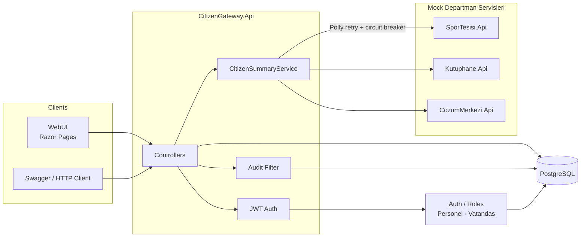

# CitizenGateway — Vatandaş Servis Entegrasyon Gateway

Örnekköy Belediyesi’nin farklı departman sistemleri arasında köprü kuran **Vatandaş Servis Entegrasyon Gateway** kavramsal demosudur.

Amaç: vatandaşın spor tesisi, kütüphane ve çözüm merkezindeki verilerini tek noktadan konsolide etmek; departmanlar arası talep akışını yönetmek.

## ⚠️ Sentetik veri uyarısı

Bu proje **tamamen sentetik / üretilmiş (fake)** veri ile çalışır.

- Gerçek hiçbir kişinin T.C. kimlik numarası, adı veya kişisel verisi **yoktur**.
- Gerçek belediye sistemlerine bağlantı **yoktur**.
- SporTesisi, Kutuphane ve CozumMerkezi servisleri solution içinde **mock** olarak simüle edilir.
- Seed verisi Bogus ile üretilir; T.C. numaraları yalnızca geçerli *formatta* sahte değerlerdir.

---

## Mimari



**Katmanlar (Clean Architecture)**

| Katman | Proje | Sorumluluk |
|--------|--------|------------|
| Domain | `CitizenGateway.Domain` | Entity, enum, value object, domain hataları |
| Application | `CitizenGateway.Application` | Use case’ler, DTO’lar, kontratlar |
| Infrastructure | `CitizenGateway.Infrastructure` | EF Core, seed, HttpClient + Polly |
| Api | `CitizenGateway.Api` | Controllers, JWT, middleware/filter |
| Presentation | `CitizenGateway.WebUI` | Minimal Razor Pages UI |
| Mocks | `MockServices/*` | Departman simülasyonları |

---

## Teknoloji yığını

- .NET 8 / ASP.NET Core Web API
- Entity Framework Core (Code-First) + PostgreSQL (Npgsql)
- JWT Bearer Authentication
- Polly (retry + circuit breaker)
- Bogus (sentetik veri)
- Swagger / OpenAPI
- xUnit + Moq + FluentAssertions
- WebApplicationFactory + Testcontainers (PostgreSQL)
- Docker + docker-compose
- Razor Pages (minimal UI)

---

## Nasıl çalıştırılır?

### Seçenek A — Docker Compose (önerilen)

```bash
docker compose up --build
```

| Servis | URL |
|--------|-----|
| Gateway + Swagger | http://localhost:5100/swagger |
| SporTesisi | http://localhost:5101/swagger |
| Kutuphane | http://localhost:5102/swagger |
| CozumMerkezi | http://localhost:5103/swagger |
| WebUI | http://localhost:5104 |
| PostgreSQL | localhost:5433 (`postgres` / `postgres`) |

Durdurmak için: `docker compose down`

### Seçenek B — Lokal `dotnet run`

1. PostgreSQL ayakta olsun; connection string:
   `Host=localhost;Port=5432;Database=citizen_gateway;Username=postgres;Password=postgres`
2. Üç mock servisi başlatın:

```bash
dotnet run --project src/MockServices/SporTesisi.Api --launch-profile http
dotnet run --project src/MockServices/Kutuphane.Api --launch-profile http
dotnet run --project src/MockServices/CozumMerkezi.Api --launch-profile http
```

3. Gateway ve WebUI:

```bash
dotnet run --project src/CitizenGateway.Api --launch-profile http
dotnet run --project src/CitizenGateway.WebUI --launch-profile http
```

> Provider değiştirmek kolaydır: `Infrastructure/DependencyInjection.cs` içinde `UseNpgsql(...)` satırını `UseSqlServer` / `UseSqlite` ile değiştirmeniz yeterlidir. Connection string `appsettings.json` → `ConnectionStrings:GatewayDb`.

### Demo kullanıcılar (seed)

| Kullanıcı | Şifre | Rol | Not |
|-----------|-------|-----|-----|
| `personel` | `Personel123!` | Personel | Tüm TC’lere erişir |
| `vatandas` | `Vatandas123!` | Vatandas | Yalnızca kendi TC’si (`71151275166`) |

Örnek sorgu TC: `71151275166`

---

## Endpoint listesi

| Method | Endpoint | Açıklama | Yetki |
|--------|----------|----------|-------|
| POST | `/api/auth/login` | JWT üretir | Herkese açık |
| GET | `/api/citizen/{tcNo}/summary` | 3 mock servise paralel istek; konsolide özet (`PartialFailure` destekli) | Personel: herkes · Vatandaş: kendi TC |
| POST | `/api/citizen/{tcNo}/requests` | Yeni talep oluşturur, mock’a iletir, DB’ye yazar | Personel + Vatandaş (kendi adına) |
| GET | `/api/citizen/{tcNo}/requests` | Geçmiş talepleri listeler | Personel: herkes · Vatandaş: kendi TC |
| GET | `/api/audit-logs` | Audit kayıtları | Sadece Personel |
| GET | `/health` | Gateway + DB + mock servis durumu | Herkese açık |

Mock servisler: her birinde `GET /api/{tcNo}` (Bogus ile seed edilmiş ~25 sentetik vatandaş).

---

## Test nasıl çalıştırılır?

```bash
# Tüm testler
dotnet test

# Sadece unit
dotnet test tests/CitizenGateway.UnitTests

# Entegrasyon (Docker gerekir — Testcontainers PostgreSQL)
dotnet test tests/CitizenGateway.IntegrationTests
```

**Kapsam (kısa not)**

- **Unit:** `CitizenSummaryService` birleştirme + PartialFailure, talep oluşturma (geçersiz TC), `AuditLogger` Moq Verify, `CitizenAccessGuard` (vatandaş başka TC → red).
- **Integration:** `WebApplicationFactory` ile login → token, tokensiz → 401, personel → 200 shape, vatandaş başka TC → 403. Her koleksiyon izole PostgreSQL container kullanır.

İsimlendirme: `MethodName_Senaryo_BeklenenSonuc`.

---

## Neden bu mimari?

Clean Architecture, iş kurallarını (Domain/Application) EF Core ve HTTP detaylarından ayırır; use case’ler Moq ile doğrudan test edilebilir. Polly, geçici ağ hatalarında retry ve ardışık hatalarda circuit breaker ile gateway’in tek bir çöken departman yüzünden tamamen düşmesini engeller; `/summary` kısmi yanıt dönebilir. Mock servislerin ayrı process olması, gerçek entegrasyon sınırını (timeout, 404, resilience) demo eder — tek process içi fake’den daha öğreticidir. Aşırı katman/soyutlama bilerek kaçınılmıştır; bu bir mülakat/portföy demosudur, production ERP değildir.

---

## Solution yapısı

```
CitizenGateway.sln
├── src/
│   ├── CitizenGateway.Domain/
│   ├── CitizenGateway.Application/
│   ├── CitizenGateway.Infrastructure/
│   ├── CitizenGateway.Api/
│   ├── CitizenGateway.WebUI/
│   └── MockServices/
│       ├── MockServices.Shared/
│       ├── SporTesisi.Api/
│       ├── Kutuphane.Api/
│       └── CozumMerkezi.Api/
├── tests/
│   ├── CitizenGateway.UnitTests/
│   └── CitizenGateway.IntegrationTests/
├── docker-compose.yml
└── README.md
```
